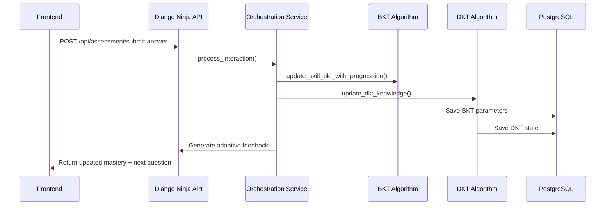
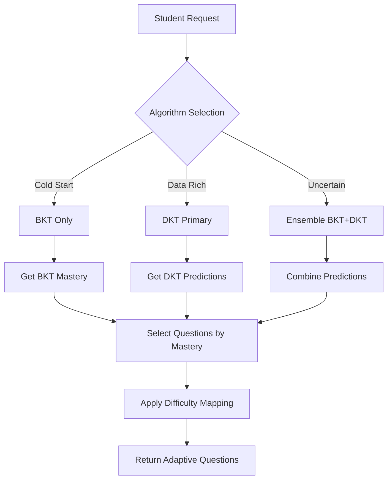
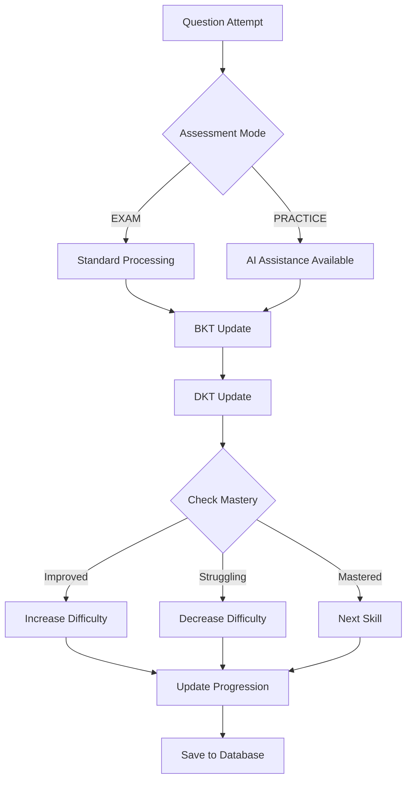
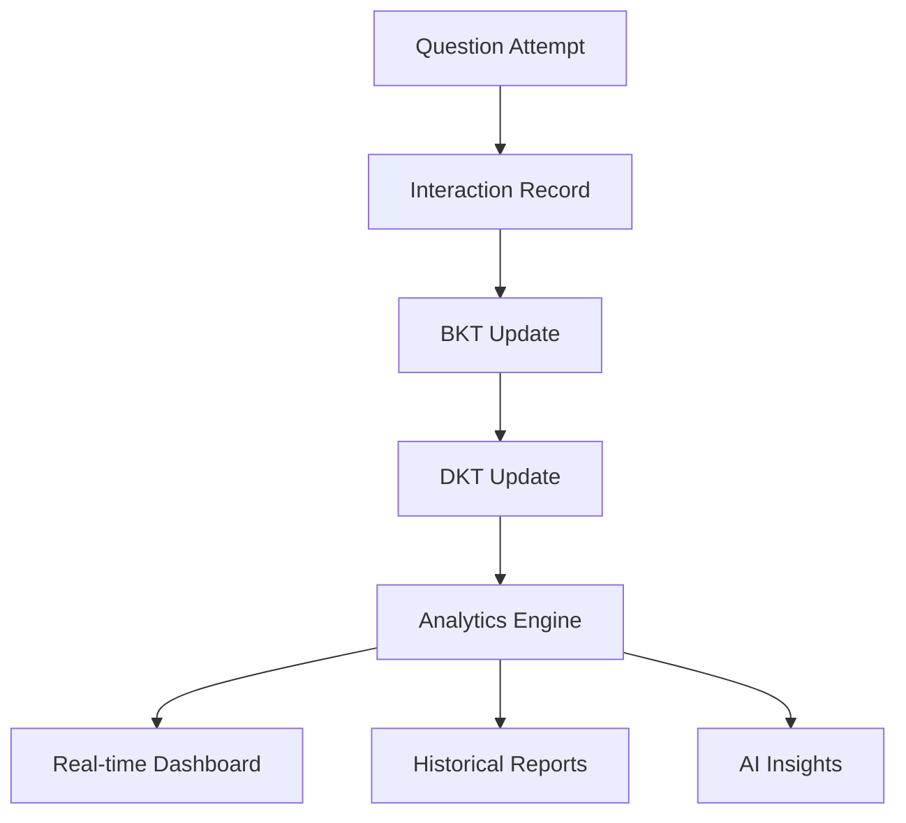

# 🏗️ Mid-Level Architecture Document

## 🎯 System Overview

This document provides a comprehensive mid-level architecture overview of the **Adaptive Learning System** - a **monolithic Django-based** intelligent tutoring platform that integrates **Bayesian Knowledge Tracing (BKT)** and **Deep Knowledge Tracing (DKT)** algorithms with **LangGraph orchestration** for personalized learning experiences.

**Key Constraints:**
- ❌ **NO Microservice Architecture** - All components integrated within Django
- ❌ **NO SM2/SRS** - No spaced repetition system implemented
- ✅ **Monolithic Design** - Single Django application with integrated AI algorithms

## 🏛️ Architecture Overview

```
┌─────────────────────────────────────────────────────────────────────────┐
│                      ADAPTIVE LEARNING SYSTEM                           │
│                     (Monolithic Django Architecture)                   │
├─────────────────────────────────────────────────────────────────────────┤
│  ┌─────────────┐  ┌─────────────────────────────────────────────────┐    │
│  │   React     │  │              Django Backend                     │    │
│  │  Frontend   │◄►│        (Integrated BKT + DKT)                   │    │
│  │  (Port 3000)│  │                                             │    │
│  └─────────────┘  └─────────────────────────────────────────────────┘    │
│           │                 │                          │                 │
│           └─────────────────┼──────────────────────────┼─────────────────┘
│                             │                          │
│                ┌────────────▼────────────┐ ┌─────────────▼─────────────┐
│                │                        │ │                          │
│     ┌──────────▼─────────┐  ┌───────────▼──────────┐ ┌▼─────────┐ ┌────────▼────────┐
│     │   BKT Algorithm    │  │   DKT Algorithm      │ │LangGraph │ │  PostgreSQL     │
│     │                    │  │                      │ │Orchestrator│ │  Database       │
│     │ • Bayesian Updates │  │ • LSTM Sequence      │ │          │ │                 │
│     │ • Skill Mastery    │  │ • Pattern Recognition│ │          │ │                 │
│     │ • Real-time        │  │ • Mock Implementation│ │          │ │                 │
│     └────────────────────┘  └──────────────────────┘ └──────────┘ └─────────────────┘
└─────────────────────────────────────────────────────────────────────────┘
```

## 🎯 Core Tech Stack Diagram

```
┌─────────────────────────────────────────────────────────────────┐
│                    ADAPTIVE LEARNING SYSTEM                     │
├─────────────────────────────────────────────────────────────────┤
│  ┌─────────────┐  ┌─────────────┐  ┌─────────────┐  ┌─────────┐  │
│  │   React     │  │   Django    │  │  PostgreSQL │  │ LangGraph│ │
│  │  Frontend   │  │  Backend    │  │ Database    │  │Orchestrator│ │
│  │             │  │             │  │             │  │          │ │
│  │ • TypeScript│  │ • Django    │  │ • Models    │  │ • BKT    │ │
│  │ • Tailwind  │  │ • Ninja API │  │ • Relations │  │ • DKT    │ │
│  │ • Recharts  │  │ • Python    │  │ • Queries   │  │ • Workflow│ │
│  └─────────────┘  └─────────────┘  └─────────────┘  └─────────┘  │
│           │              │                 │              │       │
│           └──────────────┼─────────────────┼──────────────┘       │
│                          │                 │                      │
│              ┌───────────▼─────────────────▼───────────┐          │
│              │                                        │          │
│      ┌───────▼───────┐  ┌──────────▼──────────┐         │          │
│      │    BKT         │  │        DKT           │         │          │
│      │ Algorithm      │  │   Algorithm         │         │          │
│      │                │  │                     │         │          │
│      │ • Bayesian     │  │ • Mock LSTM         │         │          │
│      │ • Inference    │  │ • Sequence Modeling │         │          │
│      │ • Real-time    │  │ • Pattern Recognition│         │          │
│      └───────────────┘  └─────────────────────┘         │          │
└─────────────────────────────────────────────────────────────────┘
```

## 🔄 BKT + DKT + LangGraph Integration Flow

```mermaid
graph TD
    A[Student Answer] --> B{LangGraph Orchestrator}
    B --> C[BKT Algorithm]
    B --> D[DKT Algorithm]
    
    C --> E[Bayesian Update]
    D --> F[Sequence Analysis]
    
    E --> G[Update Mastery P(L)]
    F --> H[Generate Predictions]
    
    G --> I{Difficulty Decision}
    H --> I
    
    I -->|Struggling| J[Decrease Difficulty]
    I -->|Improving| K[Increase Difficulty]
    I -->|Mastered| L[Next Skill]
    
    J --> M[Select Easier Question]
    K --> N[Select Harder Question]
    L --> O[Select New Topic]
    
    M --> P[Return Adaptive Question]
    N --> P
    O --> P
```

## 🧩 Component Architecture

### 1. **Frontend Layer (React + TypeScript)**
```
frontend/
├── client/src/
│   ├── components/
│   │   ├── student/
│   │   │   ├── adaptive-learning-interface.tsx    # Main learning UI
│   │   │   ├── assessment-interface-new.tsx       # Question interface
│   │   │   └── assessment-history.tsx             # Progress tracking
│   │   ├── admin/
│   │   │   ├── enhanced-reports-view.tsx          # Analytics dashboard
│   │   │   └── students-list.tsx                  # Student management
│   │   └── ui/                                    # Reusable components
│   ├── hooks/
│   │   ├── use-auth.tsx                           # Authentication
│   │   ├── use-mobile.tsx                         # Mobile detection
│   │   └── use-toast.ts                           # Notifications
│   └── pages/
│       ├── student-dashboard.tsx                  # Student main page
│       ├── admin-dashboard.tsx                    # Admin interface
│       └── auth-page.tsx                          # Authentication
```

### 2. **Backend Layer (Monolithic Django + Django Ninja)**

#### **Core Application Structure**
```
Backend/
├── adaptive_learning/                    # Django Project Settings
│   ├── settings.py                      # Main configuration
│   ├── urls.py                         # URL routing
│   └── asgi.py                         # ASGI configuration
├── core/                               # Core models and user management
│   ├── models.py                      # User, StudentProfile
│   └── api.py                         # Core API endpoints
├── student_model/                      # AI Algorithm implementations
│   ├── bkt.py                         # Bayesian Knowledge Tracing
│   ├── dkt.py                         # Deep Knowledge Tracing (Mock LSTM)
│   ├── models.py                      # Algorithm-specific models
│   └── api.py                         # BKT/DKT API endpoints
├── assessment/                        # Question and assessment system
│   ├── models.py                      # Question, Interaction, ExamSession
│   ├── api.py                         # Assessment API endpoints
│   └── ai_analysis.py                 # AI-powered analysis
├── orchestration/                     # LangGraph orchestration service
│   ├── orchestration_service.py       # BKT + DKT integration
│   ├── api.py                         # Orchestration API
│   └── simple_orchestrator.py         # Simplified orchestration
└── analytics/                         # Learning analytics
    ├── models.py                      # Analytics data models
    └── api.py                         # Analytics API endpoints
```

## 🧠 AI Algorithm Architecture

### **Bayesian Knowledge Tracing (BKT) Implementation**

#### **Core Algorithm (`student_model/bkt.py`)**
```python
@dataclass
class BKTParameters:
    P_L0: float    # Initial probability of knowing the skill
    P_T: float     # Learning rate (transition probability)
    P_G: float     # Guess rate (correct without knowing)
    P_S: float     # Slip rate (wrong despite knowing)
    P_L: float     # Current probability of knowing the skill

def update_bkt(bkt_params: BKTParameters, is_correct: bool) -> BKTParameters:
    """Bayesian update based on student response"""
    # 1. Update P(L) using Bayes' rule based on correctness
    # 2. Apply learning transition: P(L_t+1) = P_L_given_evidence + P_T * (1 - P_L_given_evidence)
    # 3. Ensure probability bounds [0, 1]
```

#### **BKT Service Layer**
```python
class BKTService:
    @staticmethod
    def get_skill_bkt_params(user: User, skill_id: str) -> BKTParameters:
        """Get or initialize BKT parameters for a skill"""
    
    @staticmethod
    def update_skill_bkt_with_progression(user, skill_id, is_correct, interaction_data):
        """Update BKT with level progression logic"""
    
    @staticmethod
    def get_mastered_skills(user: User, threshold: float = 0.95) -> Dict[str, float]:
        """Get all mastered skills above threshold"""
```

#### **Key Features**
- **Real-time Updates**: Bayesian inference after each question
- **Skill Mastery Tracking**: P(L) ≥ 0.95 considered mastered
- **Level Progression**: Integration with difficulty adjustment
- **Database Integration**: Persistent storage in StudentProfile

### **Deep Knowledge Tracing (DKT) Implementation**

#### **Core Algorithm (`student_model/dkt.py`)**
```python
@dataclass
class DKTInteraction:
    skill_id: str
    is_correct: bool
    response_time: Optional[float] = None
    timestamp: Optional[str] = None

class MockDKTModel:
    """Mock LSTM implementation for sequence modeling"""
    def predict(self, interaction_sequence: List[DKTInteraction], skill_mapping: Dict[str, int]):
        """Generate predictions based on interaction history"""
        # 1. Analyze interaction patterns using mock LSTM logic
        # 2. Apply skill transfer effects
        # 3. Generate hidden state representation
        # 4. Return skill mastery predictions
```

#### **DKT Service Layer**
```python
class DKTService:
    DEFAULT_SKILLS = [
        'quantitative_aptitude_algebra',
        'quantitative_aptitude_arithmetic',
        'logical_reasoning_analytical',
        # ... 17 total skills for competitive exams
    ]
    
    def update_dkt_knowledge(self, user, skill_id, is_correct, interaction_data):
        """Update DKT knowledge state within Django"""
    
    def get_all_predictions(self, user: User) -> Dict[str, float]:
        """Get predictions for all skill categories"""
```

#### **Key Features**
- **Integrated Implementation**: Runs within Django (no microservice)
- **Mock LSTM Logic**: Simplified neural network simulation
- **17 Skill Categories**: Focused on competitive exam subjects
- **Monolithic Architecture**: Tightly integrated with Django ORM

### **LangGraph Orchestration (`orchestration/orchestration_service.py`)**

#### **Orchestration Service**
```python
class OrchestrationService:
    def __init__(self):
        self.bkt_service = BKTService()
        self.dkt_service = DKTService()
    
    def process_interaction(self, student_username, subject, question_id,
                          is_correct, time_spent, difficulty_level):
        """Process interaction through both BKT and DKT within Django"""
        # 1. Update BKT parameters in database
        # 2. Update DKT knowledge state in database
        # 3. Generate adaptive feedback
        # 4. Calculate mastery progression
        # 5. Return orchestrated response
```

#### **Intelligent Algorithm Selection**
```python
def select_optimal_algorithm(interaction_count, bkt_mastery, dkt_confidence):
    """Choose best algorithm based on data availability"""
    if interaction_count < 5:
        return 'bkt'  # Cold start - BKT better for limited data
    elif dkt_confidence > 0.8:
        return 'dkt'  # High confidence DKT for pattern recognition
    else:
        return 'ensemble'  # Combine both approaches for best results
```

## 🗄️ Database Architecture

### **Core Models (`core/models.py`)**
```python
class StudentProfile(models.Model):
    user = models.OneToOneField(User, on_delete=models.CASCADE)
    bkt_parameters = models.JSONField()           # BKT skill states
    dkt_hidden_state = models.JSONField()         # DKT LSTM state
    fundamentals_scores = models.JSONField()      # Skill mastery scores
    interaction_history = models.JSONField()      # Recent interactions
    preferences = models.JSONField()              # Learning preferences
```

### **Assessment Models (`assessment/models.py`)**
```python
class AdaptiveQuestion(models.Model):
    # Question content and metadata
    question_text = models.TextField()
    subject = models.CharField(max_length=25)
    difficulty_level = models.CharField(max_length=15)
    answer = models.CharField(max_length=1)
    
    # IRT Parameters
    difficulty = models.FloatField(default=0.0)
    discrimination = models.FloatField(default=1.0)
    guessing = models.FloatField(default=0.0)
    
    # Statistics
    times_attempted = models.IntegerField(default=0)
    times_correct = models.IntegerField(default=0)

class Interaction(models.Model):
    # Student interaction tracking
    student = models.ForeignKey(User, on_delete=models.CASCADE)
    question = models.ForeignKey(AdaptiveQuestion, on_delete=models.CASCADE)
    is_correct = models.BooleanField()
    response_time = models.FloatField()
    session_id = models.UUIDField()
    assessment_mode = models.CharField(max_length=10)  # EXAM/PRACTICE

class ExamSession(models.Model):
    # Complete exam session tracking
    student = models.ForeignKey(User, on_delete=models.CASCADE)
    subject = models.CharField(max_length=25)
    status = models.CharField(max_length=10)  # ACTIVE/COMPLETED/ABANDONED
    questions_attempted = models.IntegerField(default=0)
    questions_correct = models.IntegerField(default=0)
    
    # AI Analysis integration
    ai_analysis_requested = models.BooleanField(default=False)
    ai_analysis_completed = models.BooleanField(default=False)
    ai_analysis_data = models.JSONField(default=dict)
```

## 🌐 API Architecture (Django Ninja)

### **API Endpoint Structure**
```
Base URL: http://localhost:8000/api/

├── /core/                    # Core user management
├── /student-model/           # BKT/DKT algorithms (Integrated)
│   ├── /student/{id}/bkt/update      # Update BKT parameters
│   ├── /student/{id}/bkt/state/{skill}  # Get BKT state
│   ├── /student/{id}/bkt/mastered    # Get mastered skills
│   ├── /dkt/update                   # Update DKT knowledge
│   ├── /dkt/predict/{student_id}     # Get DKT predictions
│   └── /algorithms/compare/{id}      # Compare BKT vs DKT
├── /assessment/              # Question and assessment
│   ├── /sessions/                    # Session management
│   ├── /questions/                   # Question bank
│   └── /submit                       # Answer submission
├── /orchestration/           # LangGraph orchestration (Integrated)
│   ├── /adaptive-flow               # Adaptive learning flow
│   └── /knowledge-state             # Knowledge state queries
├── /analytics/               # Learning analytics
└── /reports/                 # Reports and dashboards
```

### **API Request/Response Flow**


## 🔄 Data Flow Architecture

### **Adaptive Question Selection Flow**


### **Knowledge State Update Flow**


## 🛠️ Technology Stack

### **Backend Technologies (Monolithic)**
- **Framework**: Django 5.2.6 with Django Ninja API
- **Database**: PostgreSQL (production) / SQLite (development)
- **API Documentation**: Automatic OpenAPI/Swagger generation
- **Authentication**: Django's built-in auth system

### **AI/ML Technologies (Integrated)**
- **BKT Algorithm**: Pure Python implementation with Bayesian inference
- **DKT Algorithm**: Mock LSTM implementation (no PyTorch dependency)
- **Orchestration**: LangGraph for BKT/DKT workflow integration
- **AI Integration**: Google Gemini API for post-exam analysis

### **Frontend Technologies**
- **Framework**: React 18 with TypeScript
- **State Management**: TanStack Query (React Query)
- **UI Components**: Tailwind CSS + Shadcn/UI
- **Charts**: Recharts for data visualization
- **Routing**: Wouter for client-side navigation

## 🔧 Configuration Architecture

### **Environment Configuration (`adaptive_learning/settings.py`)**
```python
# Database Configuration
DATABASES = {
    'default': {
        'ENGINE': 'django.db.backends.postgresql',
        'NAME': config('DB_NAME'),
        'USER': config('DB_USER'),
        'PASSWORD': config('DB_PASSWORD'),
        'HOST': config('DB_HOST'),
        'PORT': config('DB_PORT'),
    }
}

# CORS Configuration for React Frontend
CORS_ALLOWED_ORIGINS = [
    "http://localhost:3000",
    "http://localhost:5173",
    # ... additional origins
]

# Django Ninja API Configuration
NINJA_JWT = {
    'ACCESS_TOKEN_LIFETIME': 60 * 60,  # 1 hour
    'REFRESH_TOKEN_LIFETIME': 60 * 60 * 24 * 7,  # 1 week
}
```

## 📊 Analytics Architecture

### **Multi-Level Analytics**
1. **Real-time Analytics**: Live mastery tracking during sessions
2. **Session Analytics**: Post-session performance analysis
3. **Longitudinal Analytics**: Learning progression over time
4. **Comparative Analytics**: Peer comparison and benchmarking

### **Analytics Data Pipeline**


## 🔒 Security Architecture

### **Authentication & Authorization**
- **User Management**: Django's built-in authentication system
- **Session Security**: Secure session handling with Redis
- **CORS Protection**: Configured for frontend-backend communication
- **API Security**: JWT tokens for API authentication

### **Data Protection**
- **Input Validation**: Pydantic schemas for API validation
- **SQL Injection Prevention**: Django ORM with parameterized queries
- **XSS Prevention**: Django's template escaping and validation

## 🚀 Deployment Architecture

### **Development Environment**
```bash
# Start Django Backend (Monolithic with integrated BKT/DKT)
cd Backend
python manage.py runserver 8000

# Start React Frontend
cd frontend
npm run dev  # Runs on port 5173
```

### **Production Deployment**
- **Application Server**: Gunicorn/Nginx
- **Database**: PostgreSQL with connection pooling
- **Monitoring**: Health checks and performance monitoring
- **Scaling**: Vertical scaling (single instance with more resources)

## 🔄 Integration Points

### **External Integrations**
1. **Google Gemini API**: Post-exam analysis and explanations
2. **Redis Cache**: Session storage and performance optimization
3. **PostgreSQL Database**: Persistent data storage

### **Internal Integrations**
1. **BKT ↔ DKT**: Algorithm comparison and ensemble predictions
2. **Assessment ↔ Analytics**: Real-time performance tracking
3. **Frontend ↔ Backend**: RESTful API communication

## 📈 Performance Considerations

### **Optimization Strategies**
- **Database Indexing**: Optimized queries for skill lookups and interactions
- **Algorithm Efficiency**: Optimized Bayesian calculations for real-time updates
- **API Response Times**: Sub-200ms target for real-time features
- **Query Optimization**: Efficient Django ORM usage with select_related/prefetch_related

### **Scalability Features**
- **Monolithic Design**: Single Django application with integrated algorithms
- **Database Optimization**: Efficient queries and proper indexing
- **Vertical Scaling**: Scale up with more powerful hardware
- **Algorithm Integration**: BKT/DKT run within Django process (no inter-service calls)

## 🎯 Key Architectural Benefits

### **Advantages of Current Architecture**
1. **Simplicity**: Monolithic design with integrated BKT/DKT algorithms
2. **Algorithm Flexibility**: Easy to swap or enhance AI algorithms within Django
3. **Operational Simplicity**: Single application to deploy and manage
4. **Maintainability**: Well-structured Django codebase with clear separation
5. **Development Speed**: No inter-service communication complexity

### **Architecture Trade-offs**
1. **Scaling Limitations**: Monolithic design scales vertically, not horizontally
2. **Technology Coupling**: BKT/DKT tightly coupled with Django ORM
3. **Resource Usage**: All algorithms run within single Django process
4. **Deployment Simplicity**: Single artifact but potentially larger memory footprint

## 🔮 Future Enhancements

### **Planned Improvements**
1. **Enhanced DKT Algorithm**: Replace mock with actual PyTorch LSTM implementation
2. **Advanced Analytics**: Machine learning-based performance predictions
3. **Mobile Optimization**: Enhanced mobile-responsive design
4. **Real-time Features**: WebSocket support for live updates

### **Scalability Enhancements**
1. **Algorithm Optimization**: Improve BKT/DKT computational efficiency
2. **Database Optimization**: Advanced indexing and query optimization
3. **Caching Strategies**: Implement Django caching framework
4. **Vertical Scaling**: Optimize for larger instance deployments

---

## 📝 Conclusion

This mid-level architecture demonstrates a **monolithic Django-based adaptive learning system** that successfully integrates **BKT and DKT algorithms** with **LangGraph orchestration** for personalized education. The system focuses on **simplicity and operational efficiency** while providing sophisticated AI-driven learning experiences.

### **Core Strengths**
- **Integrated AI Algorithms**: BKT and DKT work together within Django (no microservices)
- **Operational Simplicity**: Single application deployment and management
- **Educational Focus**: Specialized for competitive exam preparation
- **Real-time Adaptation**: Live mastery tracking and difficulty adjustment

### **Architecture Philosophy**
- **Monolithic by Design**: Prioritizes development speed over horizontal scalability
- **Algorithm-Centric**: Built around BKT/DKT integration rather than service distribution
- **Educational Optimization**: Tailored for learning outcomes rather than enterprise features

The system is **immediately deployable** and provides a **solid foundation** for adaptive learning without the complexity of microservices or spaced repetition systems.